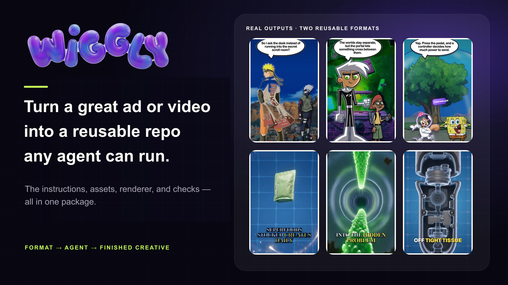
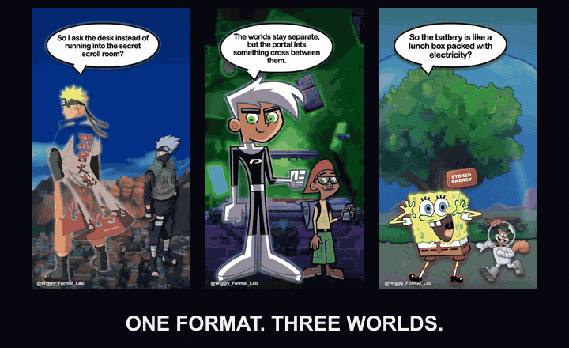
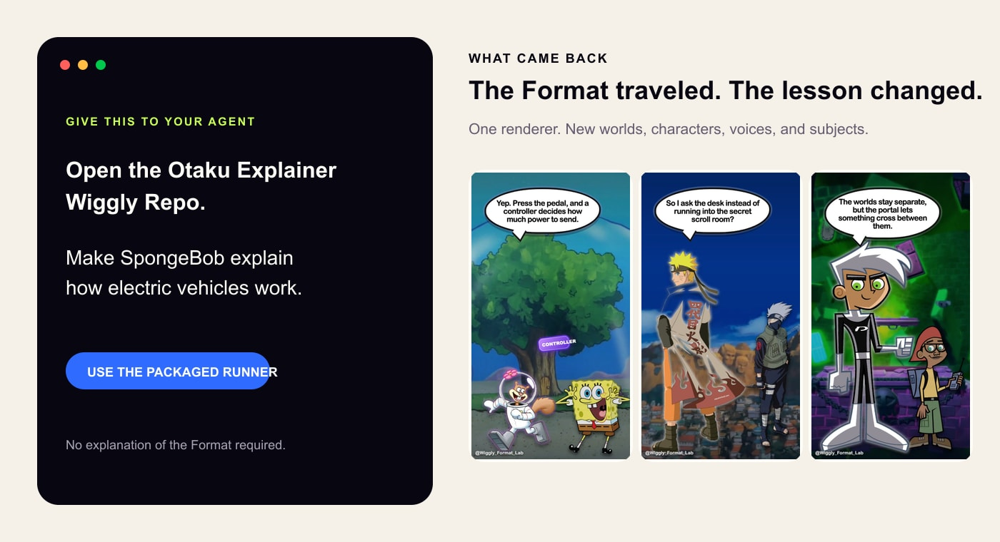
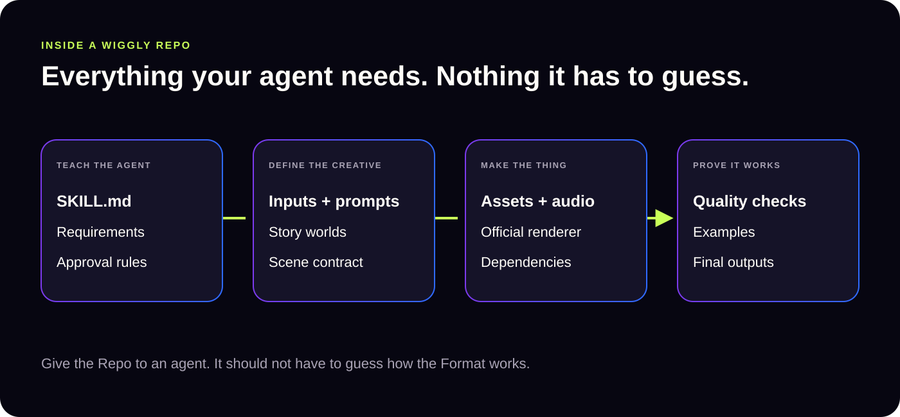
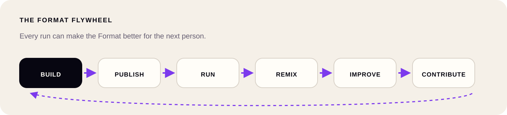

# Wiggly

<p align="center">
  
</p>

<p align="center">
  <strong>Find a Format. Hand it to your agent. Get the finished ad or video back.</strong>
</p>

<p align="center">
  <a href="https://wiggly.agentenamel.com">Open Wiggly</a>
  ·
  <a href="https://wiggly.agentenamel.com/format-lab/cartoon-explainer">Run Cartoon Explainer</a>
  ·
  <a href="https://wiggly.agentenamel.com/format-lab/three-d-breakdown">Run 3D Breakdown</a>
</p>

A great AI-made ad or video is more than a prompt. It has reference images,
model settings, voices, music, timing, a renderer, and the small decisions that
make everything work.

A **Format** is the recipe for making one kind of creative. A **Wiggly Repo**
packages that recipe with the assets, runner, and checks an agent needs to make
the finished file.

Hand the Repo to Claude, Codex, or another coding agent. It asks you for
anything missing, uses the included runner, checks its work, and gives you the
result.

## One Format made all six videos

<p align="center">
  
</p>

We did not build these six videos one by one. **Cartoon Explainer** used the same
renderer for Naruto, Danny Phantom, and SpongeBob. **3D Breakdown** used the
same renderer for Kiala, Grüns, and Theragun.

- **[Cartoon Explainer](https://wiggly.agentenamel.com/format-lab/cartoon-explainer)**
  - Changed: characters, voices, backgrounds, and lesson.
  - Reused: layouts, speech bubbles, pacing, renderer, and checks.
- **[3D Breakdown](https://wiggly.agentenamel.com/format-lab/three-d-breakdown)**
  - Changed: brand, product, story, images, and narration.
  - Reused: production steps, blue 3D look, renderer, and checks.

## Try it with your agent

Copy this into Claude or Codex:

```text
Open https://wiggly.agentenamel.com/format-lab/cartoon-explainer
and make SpongeBob explain how electric vehicles work.
Use the included runner. Check the video before you send it back.
```

<p align="center">
  
</p>

That was the entire request. The Repo supplied the files, rules, renderer, and
checks that produced the SpongeBob video above.

## What is inside a Wiggly Repo?

<p align="center">
  
</p>

Every Format can work differently. A cartoon explainer should not be forced
into the same box as a product breakdown or a static ad. But every agent needs
five answers:

- **What am I making?** The instructions and examples.
- **What do I need from the user?** The inputs and API keys.
- **What am I allowed to change?** The prompts, roles, scenes, and timing rules.
- **Which files and tools must I use?** The assets, audio, dependencies, and renderer.
- **How do I know it is good?** The finished examples and checks.

## Make a good Format once. Let other people build on it.

<p align="center">
  
</p>

People should be able to publish a Format, make their own version, improve it,
and share that work back. The next person should start with the better version
instead of repeating the same mistakes.

That is the part of GitHub we want to bring to creative work.

## What you can run today

- The live Wiggly app can read a store and turn what it finds into ad ideas.
- Cartoon Explainer and 3D Breakdown are downloadable and come with their real runners.
- Both have finished videos across different brands, characters, voices, and topics.
- Both tell the agent what it needs and stop broken work from being called finished.

These are working prototypes, not a finished marketplace. They prove the
important part: an agent can pick up someone else's Format and run it without
being taught every step.

## Run Wiggly locally

```bash
npm install
npm run dev
```

The v3 app starts at [`http://localhost:3020/create`](http://localhost:3020/create).
See [Development](docs/development.md) for environment setup, runtime checks,
architecture references, and deployment notes.
