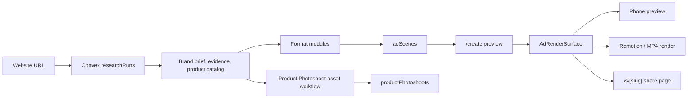

# Wiggly Graphify Map

Last updated: 2026-07-01

Graphify was not previously checked into this repo. This pass creates the first
portable graph snapshot for the v3 app:

- `graphify-out/graph.json` - code graph, AST extraction only.
- `graphify-out/GRAPH_TREE.html` - local browsable tree view.
- `graphify-out/manifest.json` - file hash manifest.

The local Graphify cache is intentionally ignored because it stores absolute
machine paths.

## Update Commands

Use the no-LLM path by default:

```bash
graphify update . --no-cluster
graphify tree \
  --graph graphify-out/graph.json \
  --output graphify-out/GRAPH_TREE.html \
  --root . \
  --label Wiggly
```

Do not run `graphify extract`, `graphify label`, or `graphify cluster-only`
without approval. Those can use LLM credits depending on environment keys.

## Current Shape



## App Surfaces

| Surface | Main files | Owns |
| --- | --- | --- |
| Early access | `v3/app/page.tsx`, `v3/app/waitlist/page.tsx` | Email capture and `/create` entry |
| Create | `v3/app/create/CreateResearchClient.tsx` | URL input, research, format selection, preview orchestration |
| Render surface | `v3/features/render/AdRenderSurface.tsx` | One passive renderer for preview/share/export |
| Share | `v3/app/s/[slug]/*`, `v3/features/share/shareScene.ts` | Public scene playback |
| Convex | `v3/convex/*` | Research, scenes, audio, render jobs, shares, saved designs |
| Product assets | `v3/features/product-photoshoot/*`, `v3/convex/productPhotoshoots.ts` | Product image boards outside `AdScene` |

## Format Registry

All ad formats live behind `v3/features/formats/registry.ts` and render through
`AdRenderSurface`.

| Format | Module | Output |
| --- | --- | --- |
| `visualizer` | `v3/features/formats/visualizer` | Voice/audio visualizer ad |
| `meme` | `v3/features/formats/meme` | Static meme-style ad |
| `were-sorry` | `v3/features/formats/were-sorry` | Apology/confession ad |
| `video-meme` | `v3/features/formats/video-meme` | Template video meme ad |
| `jingle` | `v3/features/formats/jingle` | Brand jingle and optional brick music video |
| `text-message` | `v3/features/formats/text-message` | iMessage-style proof/pain thread |
| `brainrot` | `v3/features/formats/brainrot` | Minecraft Brainrot dialogue ad |
| `reviews` | `v3/features/formats/reviews` | Real-proof review ad variants |
| `motion-story` | `v3/features/formats/motion-story` | Ecommerce product motion story |

`Product Photoshoot` is intentionally not an `AdScene` format. It is an asset
workflow backed by `productPhotoshoots`.

## Core Data Flow

```mermaid
sequenceDiagram
  participant User
  participant Create as /create
  participant Convex
  participant Research as researchRuns
  participant Format as format module
  participant Render as AdRenderSurface
  participant Worker as render worker

  User->>Create: submit website + format
  Create->>Convex: run research if needed
  Convex->>Research: store brand brief/evidence/products
  Create->>Convex: generate format scenes
  Convex->>Format: create validated AdScene payloads
  Convex-->>Create: adScenes
  Create->>Render: selected scene
  User->>Create: save/download/share
  Create->>Convex: queue render/share
  Worker->>Render: render same scene contract
  Worker-->>Convex: output storage id
```

## Hotspots To Check First

- `v3/app/create/CreateResearchClient.tsx` is still the biggest orchestration
  surface: research, creative pack, audio, photoshoot, save/share/download, and
  selected-scene coordination.
- `v3/features/create/creativePack.ts` owns Creative Pack constants, hydration,
  timeout rules, and playable-audio checks.
- `v3/features/scene/types.ts` is the central `AdScene` contract. Renderer,
  share, save, export, and format validation all depend on it.
- `v3/convex/adScenes.ts`, `v3/convex/audioAssets.ts`, and
  `v3/convex/renderJobs.ts` are the backend mutation/action seam for generation,
  audio, and export.
- `v3/features/formats/jingle/storyboard.ts` and
  `v3/convex/jingleStoryboards.ts` are the paid image/video-heavy path. Treat
  retry and provider errors carefully.

## Useful Graphify Questions

```bash
graphify explain "create_createresearchclient" \
  --graph graphify-out/graph.json

graphify path "create_createresearchclient" "render_adrendersurface" \
  --graph graphify-out/graph.json

graphify affected "scene_types" \
  --graph graphify-out/graph.json
```

If a query misses, open `graphify-out/GRAPH_TREE.html` and copy the exact node
label Graphify generated.
