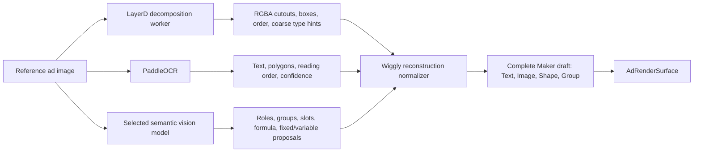

# LayerD Graphify Compatibility Assessment

- Status: Structural assessment complete; visual-quality benchmark still required
- Date: 2026-07-10
- Source: [CyberAgentAILab/LayerD](https://github.com/CyberAgentAILab/LayerD)
- Source commit: `21aef937a0371614adb4d961f52d02409cb8ecc7`
- Analysis mode: AST-only Graphify; no LLM extraction, labeling, or clustering
- Product-code impact: None

Related Wiggly documents:

- [Architecture contract](../static-format-package-architecture-contract.md)
- [Open-source ledger](../static-format-package-open-source-ledger.md)
- [Wiggly Graphify map](../graphify.md)

## 1. Verdict

LayerD **translates cleanly as one reconstruction stage**, but it is not an open-source replacement for Canva Magic Layers.

Use it as a Python worker that proposes ordered raster cutouts and geometry for a Maker draft. Do not use its `Element`, SVG, or PSD output as Wiggly's scene contract, renderer, or final editability model.

The important distinction is:

- LayerD can separate an input design into RGBA pieces, crop connected components, assign bounding boxes, preserve rough stacking order, and label pieces as `text`, `vector`, or `image`.
- Every returned piece is still a cropped PIL raster image. A `vector` is a low-entropy raster labeled `vector`, not an SVG path or native Wiggly Shape. A `text` element is rasterized text associated with an OCR region, not editable text with font and fitting data.
- Its SVG exporter positions PNG `<image>` elements. Its PSD exporter creates Photoshop pixel layers. The upstream export guide explicitly says text is preserved as raster images in both formats.

That narrower role is still valuable. It can supply much of the hard pixel separation, erasure, alpha, bounding-box, and ordering work while Wiggly, PaddleOCR, font classification, and semantic vision turn trustworthy pieces into native Text, Image, Shape, and Group layers.

**Decision:** keep LayerD as the primary decomposition benchmark candidate. Do not promote it to a production dependency until it passes the saved-reference visual benchmark.

## 2. Graph Artifacts

Local isolated clone:

```text
/Users/shaz/.graphify/repos/CyberAgentAILab/LayerD
```

Generated artifacts:

```text
/Users/shaz/.graphify/repos/CyberAgentAILab/LayerD/graphify-out/graph.json
/Users/shaz/.graphify/repos/CyberAgentAILab/LayerD/graphify-out/GRAPH_TREE.html
```

Graph summary:

- 117 extracted source files
- 1,541 serialized graph nodes
- 3,266 raw links
- 2,614 unique directed endpoint pairs in Graphify's post-build representation
- 422 dangling endpoints, primarily external or unresolved symbols
- Graph JSON size: approximately 1.4 MB
- Tree HTML size: approximately 120 KB

LayerD is registered with Wiggly, Avnac, Moveable, and Selecto in:

```text
/Users/shaz/.graphify/global-graph.json
```

## 3. What the Pipeline Actually Produces

Graphify traces the public pipeline through three clean stages:

```text
LayerDPipeline.__call__
  -> LayerD.decompose
  -> optional OCR backend
  -> LayerOrganizer.organize
  -> PipelineResult
```

`LayerD.decompose()` repeatedly performs:

1. BiRefNet matting of a foreground.
2. LaMa inpainting of the exposed background.
3. Optional foreground and background color refinement.
4. Another pass over the newly inferred background, up to `max_iterations`.

`LayerOrganizer.organize()` then splits each RGBA layer into connected components and returns this effective contract:

```text
Element {
  id: integer
  type: "text" | "vector" | "image"
  image: cropped RGBA raster
  box: { x_min, y_min, x_max, y_max }
}
```

The result does **not** include:

- Native text content on the element
- Font family, weight, line height, alignment, or fitting rules
- Native vector paths or Wiggly Shape parameters
- Rotation, opacity, blend mode, crop transform, or group hierarchy
- A confidence score for the decomposition or type classification
- Semantic roles such as logo, headline, product, proof, CTA, or decoration
- Slot, reroll-group, fixed/variable, or visual-policy decisions

The element order is usable as a starting z-order, but Wiggly must validate it visually.

## 4. Classification and OCR Reality

### `vector` means low-complexity raster

The default `EntropyLabeler` changes an `image` label to `vector` when the cropped pixels have low Shannon entropy. The alternate `GradientAwareLabeler` avoids labeling apparent gradients as vectors. Neither implementation vectorizes pixels.

Wiggly may use this label as a hint that a Maker or deterministic heuristic can redraw a simple region as a native Shape. It must not automatically claim native editability from the label alone.

### LayerD's OCR is not sufficient for Wiggly

The repository contains two OCR backends, despite the top-level README still saying OCR is “coming soon”:

| Backend | What it really does | Wiggly ruling |
| --- | --- | --- |
| EAST | Detects text regions on CPU or CUDA; returns empty `text` values | Useful only as a text-mask hint; PaddleOCR remains the primary text source |
| Transformers/GOT-OCR2 | Recognizes text on CUDA, but the current parser fabricates full-width, vertically stacked boxes and contains a TODO for real boxes | Do not use for Wiggly geometry |

There is also a documentation mismatch: some pipeline examples call the backend `got-ocr2`, while the runtime registry uses `transformers`. That is another reason not to make LayerD OCR part of Wiggly's contract.

LayerOrganizer uses OCR masks only to decide which connected pixels receive the `text` label. It does not attach the recognized string to the returned `Element`.

## 5. Clean Wiggly Integration Seam

LayerD should run outside Next.js and Convex's normal TypeScript process as an isolated Python analysis worker or job service.

Run it with `ocr_backend=None`. PaddleOCR should be a separate required stage so an OCR failure is visible and cannot be swallowed by LayerD's “continue without OCR” behavior.



Required normalization policy:

| LayerD evidence | Default Wiggly result | Promotion rule |
| --- | --- | --- |
| Background or complex decoration cutout | Locked Image layer with durable PNG asset | Remains raster unless the Maker explicitly redraws or unlocks it |
| Photographic/product cutout | Image layer with durable PNG asset and geometry | Bind to a semantic asset slot only after vision and Maker confirmation |
| OCR-matched raster text | Native Text candidate from PaddleOCR plus the raster cutout as comparison evidence | Promote only when text, box, font substitute, and visual reconstruction pass |
| Low-entropy `vector` cutout | Locked Image candidate | Promote to Shape only when a bounded heuristic can reproduce it and pixel comparison passes |
| Several related cutouts | Independent layers initially | Promote to Group only from semantic evidence or Maker action |

LayerD output must be converted into Wiggly-owned, JSON-safe analysis records and durable image assets. PIL objects and LayerD `Element` dictionaries never cross into `StaticAdScene` directly.

## 6. Compatibility With Wiggly Contracts

| Wiggly invariant | LayerD behavior | Result |
| --- | --- | --- |
| `AdRenderSurface` is the only pixel renderer | LayerD exports independent raster SVG/PSD files | Do not use its exporters in product rendering; compatible as offline analysis only |
| Complete `StaticAdScene` payloads are authoritative | LayerD returns Python images and four-field element dictionaries | Normalize into a complete Wiggly draft before any preview |
| Four primitives: Text, Image, Shape, Group | LayerD produces raster cutouts with three labels and no groups | Useful evidence, not the final primitive tree |
| Durable assets and reproducible scenes | LayerD holds PIL images in memory | Persist normalized PNGs and hashes before draft creation |
| Fail visibly; no silent model fallback | Pipeline catches OCR failures and continues without OCR | Wiggly wrapper must record the failed stage and must not silently claim text editability |
| Maker controls editability | LayerD has no Maker policy or correction UI | Wiggly owns replacement, relabeling, grouping, locking, and native promotion |
| Preview/share/download parity | LayerD's SVG/PSD are separate export paths | Reject these paths; render the normalized scene through `AdRenderSurface` |

## 7. Runtime and Operational Cost

LayerD is not a small in-process utility:

- Python 3.10 or newer
- Upstream package version `0.1.0`, installed from GitHub rather than a stable release line; pin the exact commit and worker image
- PyTorch, Torchvision, OpenCV, scikit-image, Transformers, and related ML dependencies
- Default BiRefNet checkpoint: approximately 885 MB on [Hugging Face](https://huggingface.co/cyberagent/layerd-birefnet/tree/main)
- Bundled LaMa path downloads an additional approximately 196 MB TorchScript checkpoint on first use
- Default processing size is 1024 by 1024 when model configuration is unavailable
- Every additional decomposition iteration repeats matting and inpainting against the inferred background
- Upstream recommends 16 GB RAM and an NVIDIA GPU with 8 GB or more VRAM for faster inference; CPU is supported

The MVP should therefore:

- Run one reference at a time as an asynchronous analysis job.
- Cache model weights in the worker image.
- Store stage progress so the Maker sees matting, separation, text recovery, semantic analysis, and draft assembly.
- Store the exact source commit, model IDs, parameters, and output hashes.
- Treat worker failure as a visible unsupported or failed analysis, never a fake complete draft.

This is compatible with the agreed quality-first three-to-five-minute analysis window, but actual latency must be measured on the intended worker hardware.

## 8. Verification Performed

- Fresh official repository clone at the commit above
- AST-only Graphify build and tree generation
- Targeted `path`, `explain`, `affected`, and multigraph-diagnostic queries
- Manual source trace of decomposition, organization, classification, OCR, SVG, and PSD paths
- Python 3.10 syntax compilation of `src` and `tests`: passed
- Model checkpoint and full inference were not downloaded or run during this structural assessment
- Upstream unit tests were not installed because the base dependency set includes the full PyTorch inference stack

This proves the integration boundary and output semantics. It does not prove mask quality, latency, visual fidelity, or the 85% editability gate.

## 9. Required Saved-Reference Benchmark

Run the Codex reference and 8 to 10 assistant-saved static ads through an isolated worker using the same inputs and parameters.

For every reference, record:

1. Cold and warm model-start time.
2. Per-iteration and total analysis time.
3. Peak RAM and VRAM.
4. Raw layer count, connected-component count, and unusable fragment count.
5. Foreground edge quality and background inpainting artifacts.
6. Whether text, logos, products, emoji, and decorations are cleanly isolated.
7. Correct z-order percentage.
8. PaddleOCR match and native-text reconstruction quality.
9. Percentage of elements that become native Text or Shape versus locked raster Image.
10. Assistant cleanup time to a publishable Maker draft.
11. Pixel similarity before and after cleanup.
12. Explicit supported-high-confidence, supported-low-confidence, or unsupported outcome.

LayerD passes only if the full reconstruction stack reaches the existing per-reference 85% editability gate and median assistant cleanup time of five minutes or less. A high layer count alone is not success.

If LayerD fails, classify the failure before adding another model:

- Poor object/text masks: compare Qwen-Image-Layered.
- One bad or merged object: offer an explicit SAM refinement action.
- Missing text content or boxes: improve PaddleOCR normalization.
- Semantics or grouping wrong: improve the selected vision model and Maker review.
- Simple shapes remain raster: add a bounded shape reconstruction heuristic.

## 10. Reproduction Commands

```bash
graphify clone https://github.com/CyberAgentAILab/LayerD

cd /Users/shaz/.graphify/repos/CyberAgentAILab/LayerD
graphify update . --no-cluster
graphify tree \
  --graph graphify-out/graph.json \
  --output graphify-out/GRAPH_TREE.html \
  --root . \
  --label LayerD

graphify diagnose multigraph \
  --graph graphify-out/graph.json \
  --json

graphify path \
  "layerd_pipeline_layerdpipeline_call" \
  "models_layerd_layerd_decompose" \
  --graph graphify-out/graph.json

graphify explain \
  "export_svg_svgbuilder_export" \
  --graph graphify-out/graph.json

graphify global add graphify-out/graph.json --as layerd
```

No `graphify extract`, `graphify label`, or LLM-backed clustering was used.
