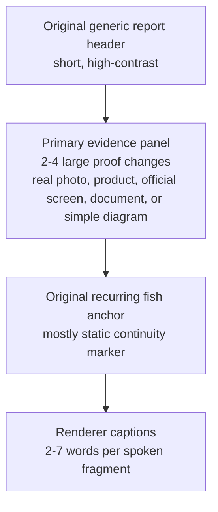

# Talking Fish News: Reference Board

## Source-Safe Board

This board records the observed layout grammar without packaging, copying, or publishing
the source character, logo, voice, music, or graphics.

## What The Viewer Should Notice First

| Priority | Viewer question | Required answer on screen |
| --- | --- | --- |
| 1 | What happened? | A concrete event in the opening caption and first evidence image. |
| 2 | Is that real? | A big recognizable product, interface state, document, location, or before/after. |
| 3 | Why should I care? | A buyer consequence shown by the next evidence change. |
| 4 | Where does the brand fit? | One factual brand mechanism or proof in the payoff. |

## Evidence Board, Not A Newsroom Set

The source works because the frame makes unfamiliar information easy to follow. It does not
depend on a detailed underwater newsroom, scrolling ticker, desk, dramatic sting, or a
performing anchor. Those additions compete with the proof and make a branded version feel
like an imitation instead of a useful report.

## Original Production Look

For a later public kit, the visual system must be deliberately original:

- a different fish character silhouette, palette, wardrobe, and name;
- an original generic report header rather than a named station or copied lower third;
- brand evidence in the upper panel, not a copied scene or source art;
- captions and calls to action rendered by Wiggly, never generated into media pixels.

## Reference Links

- [Paul Alexander compact report](https://www.youtube.com/shorts/Nzfs6Y_gs4c)
- [Apple lawsuit report](https://www.youtube.com/shorts/MZcxSnY4PcI)
- [Jake Paul v. Mike Tyson report](https://www.youtube.com/shorts/dK9_lm4zT-s)
- [Longer Teixeira case report](https://www.youtube.com/shorts/-d7u3wc6Sz4)

These links are for private format analysis. They are not assets for a Wiggly release.
