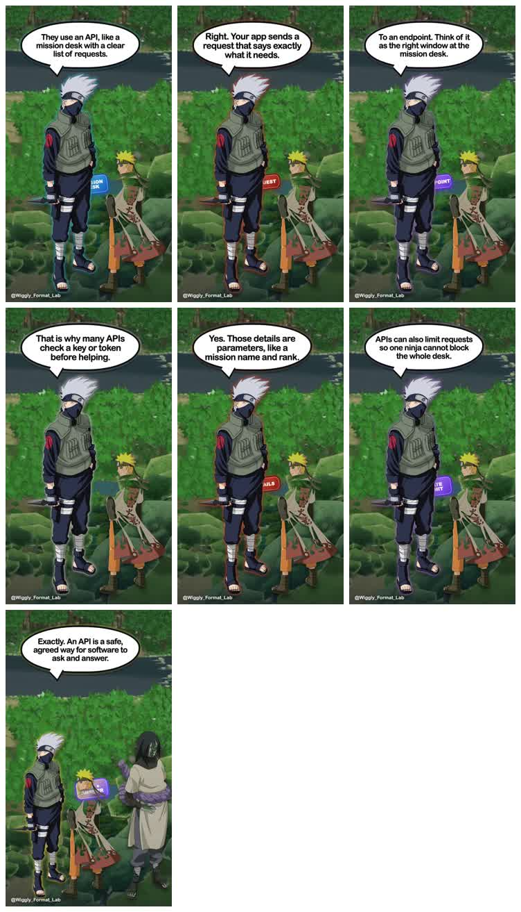
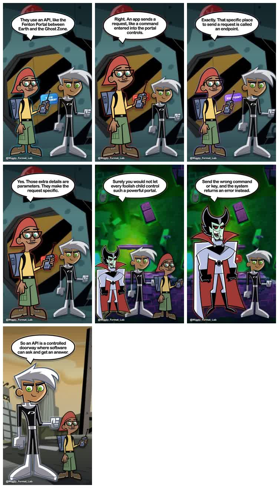
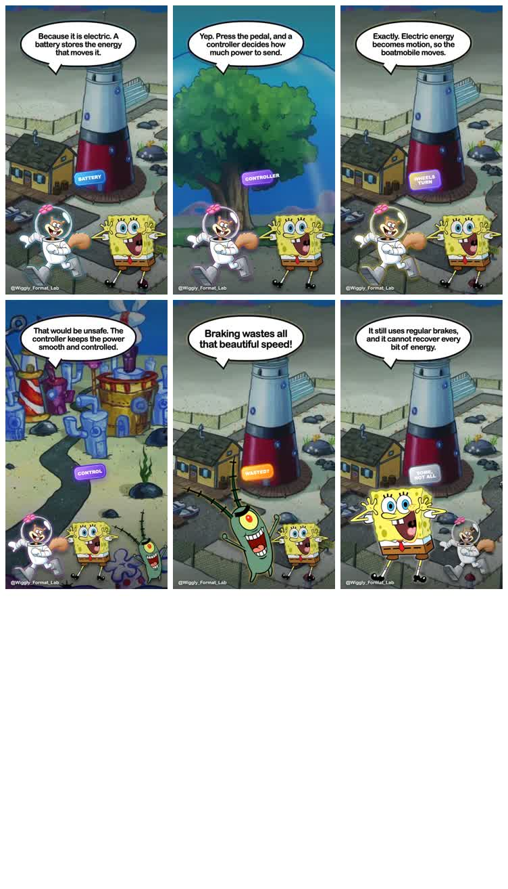

# Cartoon Explainer Format — morning report

## Result

The Wiggly Repo successfully taught an agent to make a new lesson, research a new story world, assemble its world pack, and produce a finished video without changing the renderer, runner, layouts, or scene contract.

| Proof | What changed | Scenes | Length | Attempts | Result |
|---|---|---:|---:|---:|---|
| Naruto explains compilers vs interpreters | Close rebuild of the reference | 18 | 1:14 | 1 | Pass |
| Naruto explains MCP | New lesson, same story world | 15 | 1:03 | 1 | Pass |
| Yu-Gi-Oh explains compilers vs interpreters | Same lesson, packaged world swap | 18 | 1:04 | 1 | Pass |
| Naruto explains APIs | Agent-operated control run | 15 | 1:08 | 1 | Pass |
| Danny Phantom explains APIs | Agent-researched world swap | 15 | 1:10 | 1 | Pass |
| SpongeBob explains EVs | New world and new lesson | 15 | 1:02 | 2 | Pass |

The Danny proof is the important result: the agent started with no Danny pack, researched the show and lore, selected voices, sourced and inspected six assets, wrote the lesson, validated it, rendered it, inspected it, and finalized it through the Repo instructions.

The SpongeBob proof goes one step further: the agent changed both the story world and the lesson while keeping the renderer, runner, layouts, and scene contract unchanged. The first attempt exposed a short music loop; the second attempt changed only that asset and passed.

## Cross-world proof

### Naruto control

[Watch Naruto explain APIs](outputs/naruto-apis.mp4)

The run used Naruto as learner, Kakashi as guide, and Orochimaru as challenger. All automatic and creative checks passed.

### Danny Phantom portability test

[Watch Danny Phantom explain APIs](outputs/danny-apis.mp4)

The lesson maps the Fenton Portal to an API doorway, portal commands to requests, controls to endpoints, returned results to responses, details to parameters, and access keys to authentication. Danny, Tucker, and Vlad stay inside their intended lesson roles.

### SpongeBob portability test

[Watch SpongeBob explain EVs](outputs/spongebob-evs.mp4)

SpongeBob learns how an electric boatmobile works, Sandy explains the battery, controller, inverter, motor, charging, and regenerative braking, and Plankton proposes a bad shortcut for Sandy to correct. The run used the existing layouts without adding SpongeBob-specific renderer code.

## New world evidence

### Selected voices

| Role | Character | Fish voice ID | Why it was selected |
|---|---|---|---|
| Learner | Danny Phantom | `14f06ac475944bb7a0ef5cc958f07462` | Highest-use English result with a youthful, energetic sample |
| Guide | Tucker Foley | `e3e1212180ee4f87ab0730db54d1a8e2` | Public English result with a friendly, energetic sample |
| Challenger | Vlad Plasmius | `23231b8547f04d79bebc51bb2a23b5ab` | Exact English result with an appropriately confident delivery |

### Selected assets

- Character cutouts: Danny, Tucker, and Vlad from their documented Danny Phantom Wiki pages.
- Backgrounds: Amity Park, the Fenton lab and portal, and a Ghost Zone stage with visible ground.
- Every query, source page, source URL, and local path is recorded in `assets.json`.
- The canonical character files already had clean transparency, so no AI image generation or custom cleanup system was needed.

## What the Repo handled

- Reported the required key names and local tools without exposing secret values.
- Enforced 12–18 scenes, short dialogue, approved layouts, valid roles, valid backgrounds, and a three-attempt ceiling before media spending.
- Mapped lesson roles to world-specific characters and Fish voices.
- Turned role-based scenes into the existing renderer's character positions.
- Generated a contact sheet and technical report after each render.
- Refused finalization until every automatic and creative check passed.

## What the agent still decided

- Which story-world idea best explains the lesson.
- Which search results are clean enough to use.
- Which Fish voice sounds closest to each character.
- How to write natural dialogue and pace the lesson.
- Whether the finished video is honestly good enough to finalize.

Those are useful agent decisions, not missing framework code.

## Checks completed

- Both new videos are 720×1280 H.264 with AAC audio.
- Naruto API: 68.3 seconds; Danny API: 69.8 seconds.
- Every scene has voice audio; speech bubbles fit; characters are grounded; the API lesson is accurate.
- Existing Naruto and Yu-Gi-Oh proofs remain in the package.
- Production `/create`, `/builder`, `/share`, `AdScene`, `AdRenderSurface`, and the Format registry remain untouched.

## Cost and boundaries

Fish used the free developer voice model. Asset discovery stayed below the 20-search Serper cap. No OpenRouter, Replicate, GPU, image generation, AI video generation, or MCP was used.

## Honest limits

- Page edits are still a local prototype; changing a file on the page does not write it back to disk or start a render.
- Voice selection remains subjective even when public samples and usage data are available.
- The agent can assemble a world pack, but a person should still review likeness, asset quality, and the story analogy before publishing.
