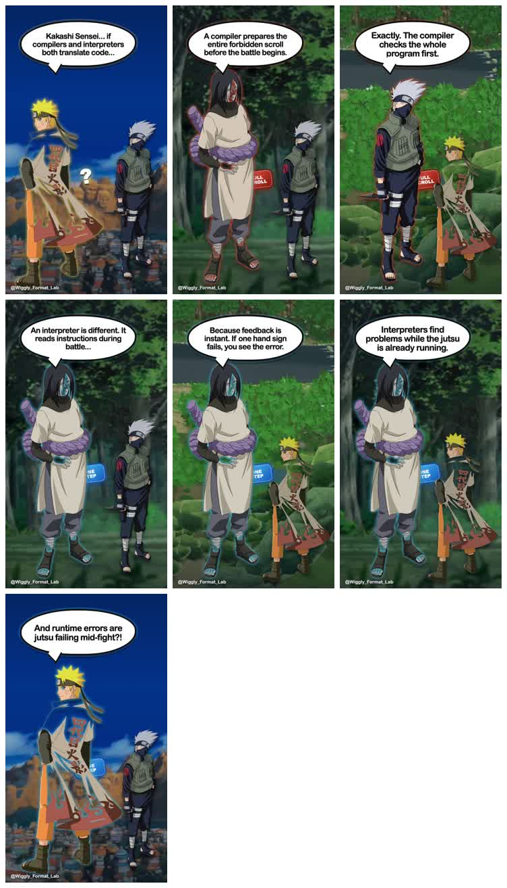
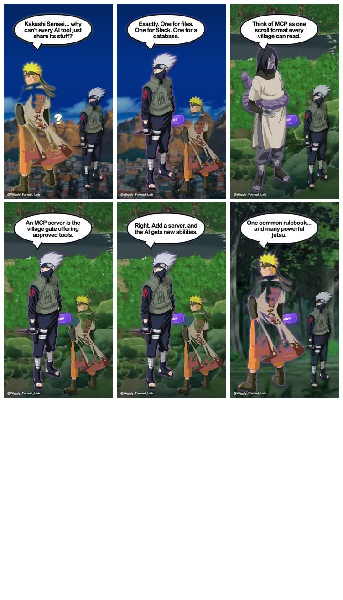
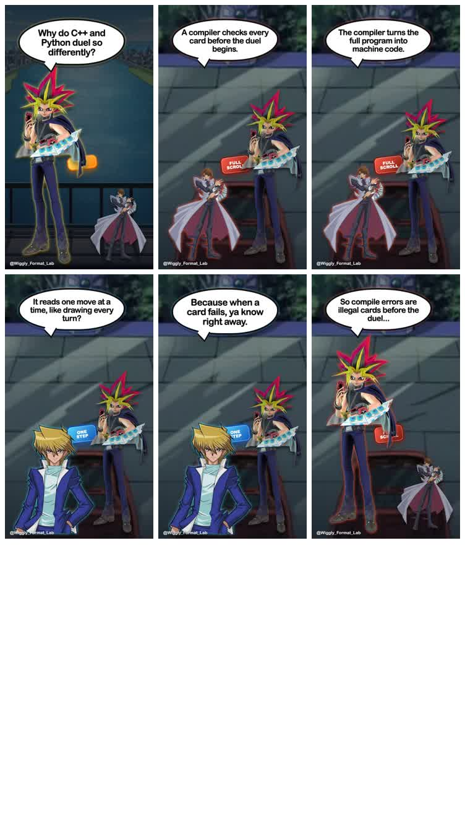

# Otaku Explainer Format — morning report

## Result

One portable Format kit now produces three complete videos through the same renderer and scene contract.

| Proof | What changed | Scenes | Length | Result |
|---|---|---:|---:|---|
| Naruto explains compilers vs interpreters | Close rebuild of the reference | 18 | 1:14 | Pass |
| Naruto explains MCP | New lesson, same story world | 15 | 1:03 | Pass |
| Yu-Gi-Oh explains compilers vs interpreters | Same lesson, new story world | 18 | 1:04 | Pass |

The package includes all nine agreed parts: instructions, inputs, fixed assets, AI-content rules, scene slots, renderer, audio, quality checks, and final outputs.

## Visual proof

### 1. Naruto rebuild

[Watch the full Naruto compiler video](outputs/naruto-compilers.mp4)

### 2. Naruto explains MCP

[Watch the full Naruto MCP video](outputs/naruto-mcp.mp4)

### 3. Yu-Gi-Oh explains compilers

[Watch the full Yu-Gi-Oh compiler video](outputs/yugioh-compilers.mp4)

## What the page lets a person do

At `/format-lab/otaku-explainer`, a person can inspect every part of the Format, edit or delete text files, replace or delete assets, inspect run records, and play all three videos. Any content or asset change visibly marks the draft **Needs rerun** while keeping the saved videos unchanged.

## Checks completed

- All four videos load at 720×1280 in a real browser: the source plus three outputs.
- Desktop and phone layouts have no horizontal overflow.
- Edit, delete, restore, reset, and asset replacement work through the visible page.
- The three runs use the same experimental renderer and exact Fish Audio voice assignments.
- Yu-Gi-Oh cutouts no longer contain fake white or checkerboard cards.
- Production `/create`, `/builder`, `/share`, `AdScene`, `AdRenderSurface`, and the Format registry remain untouched.

## Cost

Estimated paid API spend: **$0**. Dialogue used Fish Audio's free developer model. No image generator, AI video model, Seedance, OpenRouter generation, or rented GPU was used.

## Honest limits

- Page edits are a local prototype; they do not write files back to disk or run the render job in the browser.
- The scene scripts were authored for these three proofs. The next experiment should generate one fourth topic from the package rules before treating the system as broadly reusable.
- Character and background searches are documented, but the chosen images are fixed local assets for deterministic reruns.
